# DBMatch

## Match Your Project with the Perfect Database

DBMatch helps developers select the ideal database by analyzing your project’s key requirements and technical factors — powered by AI-driven recommendations for the best match every time.

## 🌐 Live Demo

👉 [Live Project](https://dbmatch.vercel.app/)

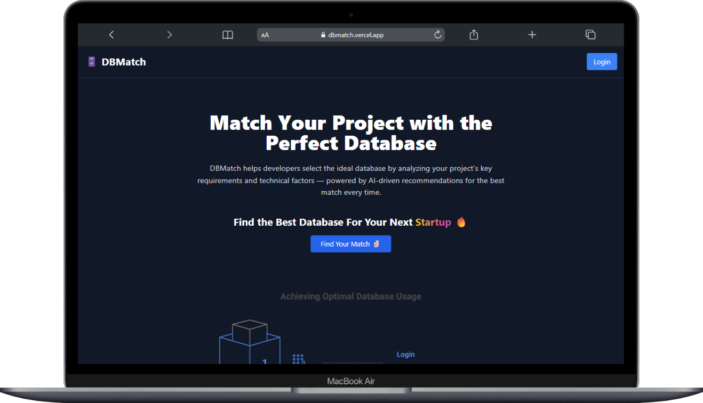

---

### Get #22 rank out of 200 on peerlist

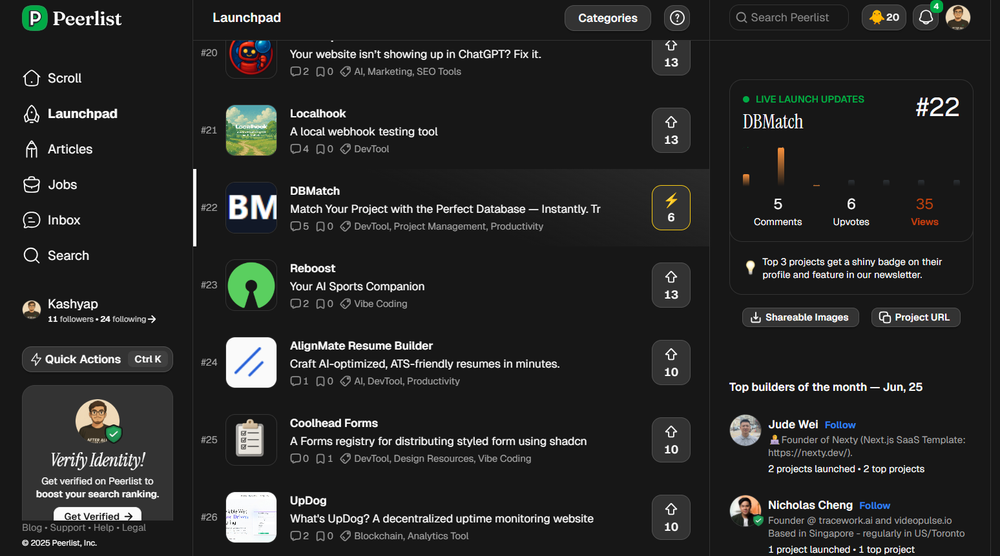


---

## 🖼️ Preview

<table>
  <tr>
    <td></td>
    <td></td>
    <td></td>
  </tr>
  <tr>
    <td>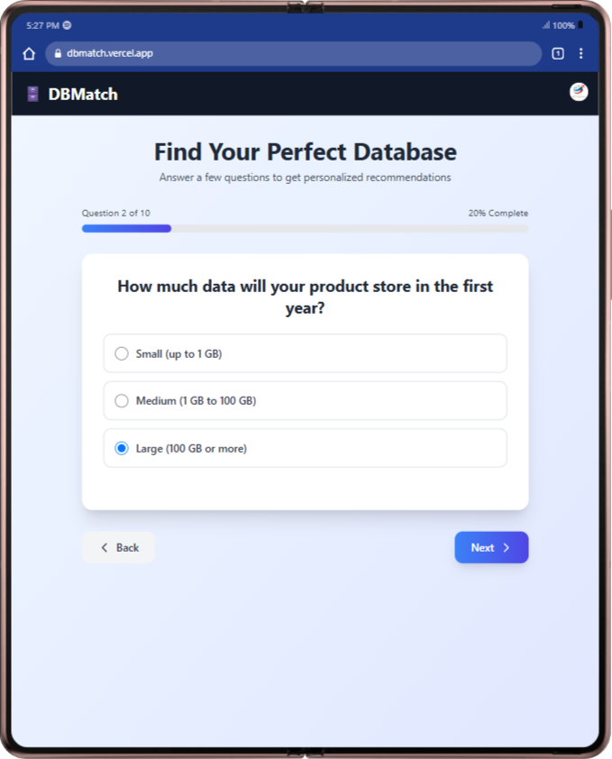</td>
    <td>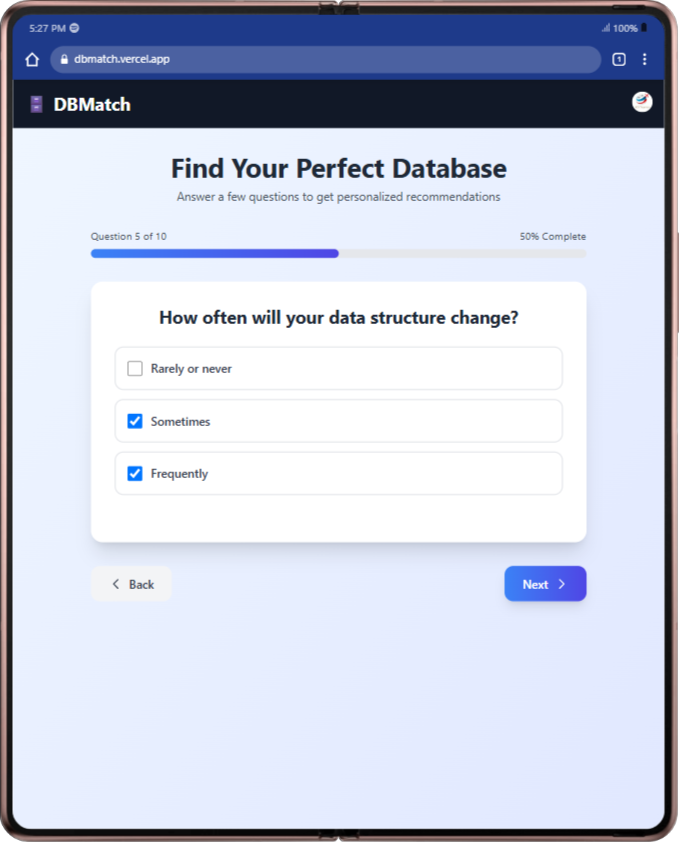</td>
    <td>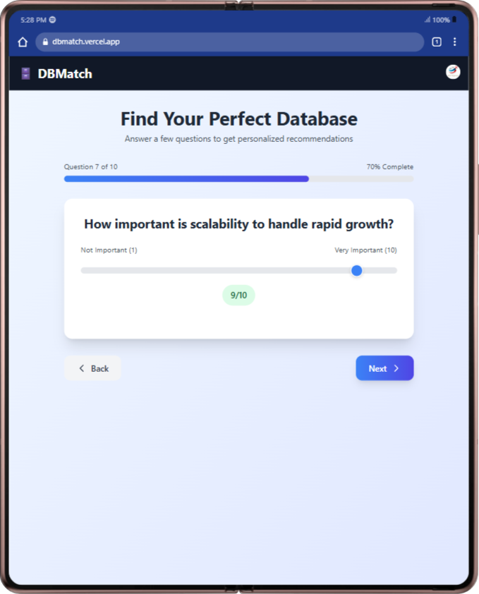</td>
  </tr>
   <tr>
    <td>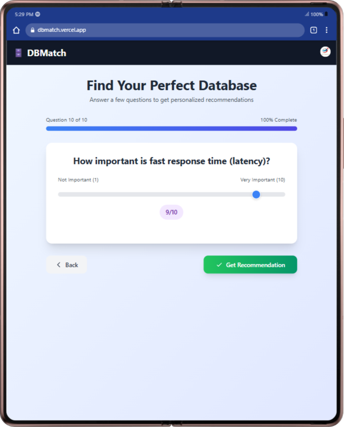</td>
    <td>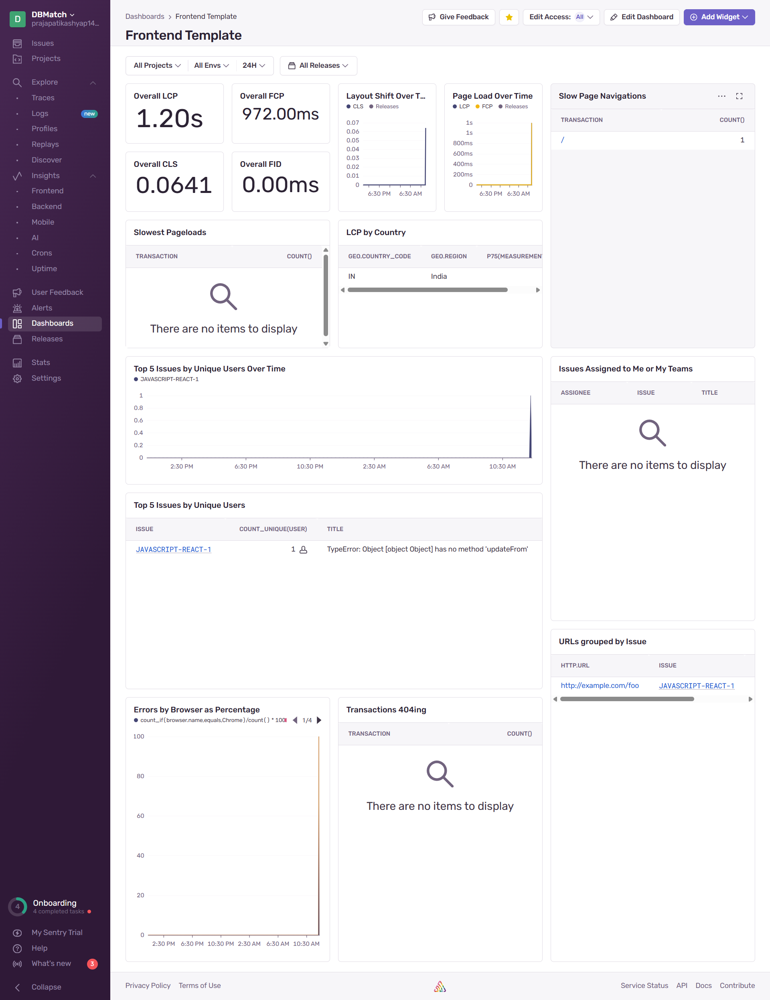</td>
    <td>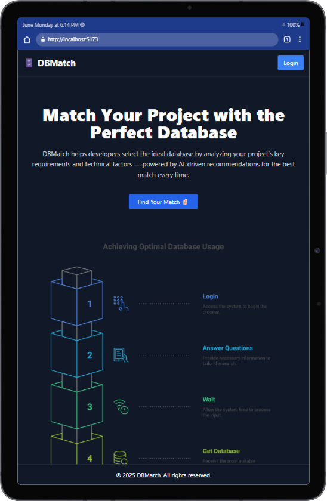</td>
  </tr>
    <tr>
    <td>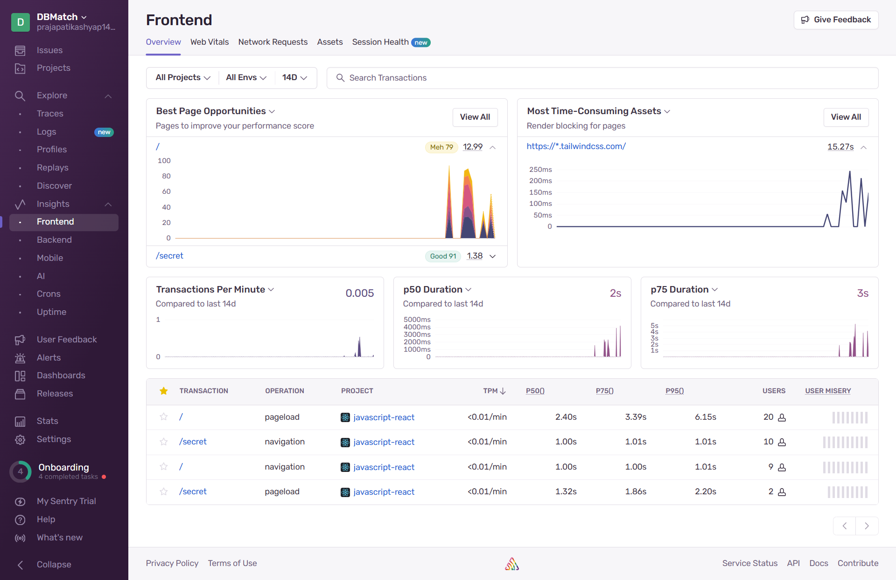</td>
    <td>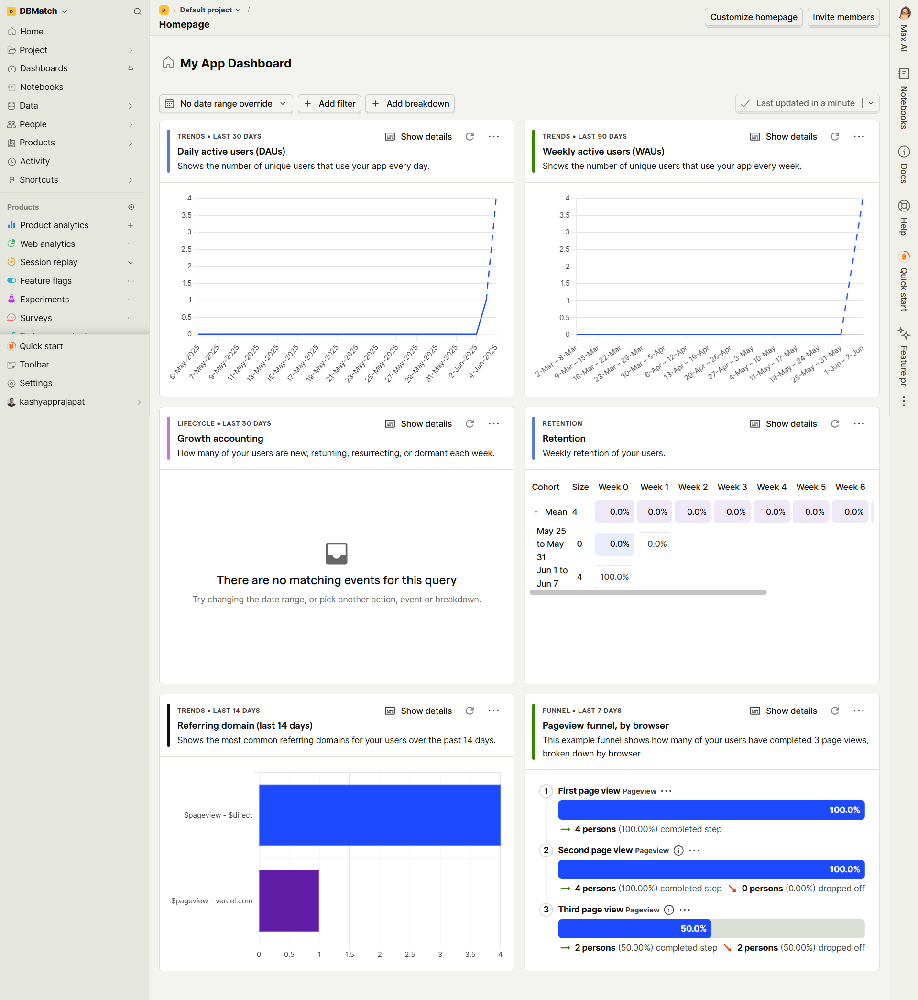</td>
    <td>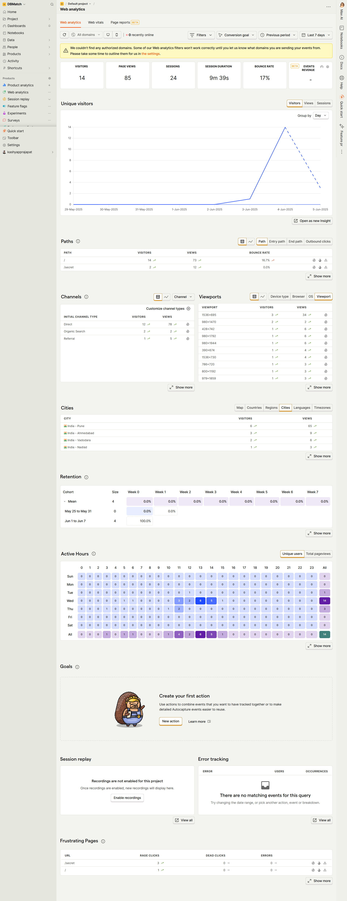</td>
  </tr>
</table>

---

### Custome Offline page 
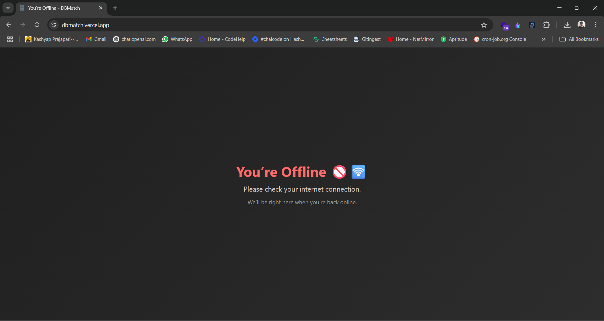

---

### SEO related things

##### Articals
[Web SEO](https://webappseo.hashnode.dev/the-complete-seo-blueprint-for-web-applications-in-2025?ref=twitter-share) | 
[Mobile SEO](https://mobileappseo.hashnode.dev/the-ultimate-mobile-app-seo-and-aso-guide-for-2025-visibility-across-web-and-stores?ref=twitter-share)

##### Live ss
<table>
  <tr>
    <td></td>
    <td>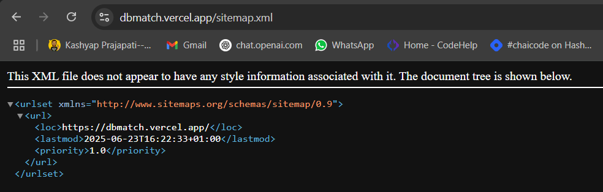</td>
  </tr>
</table>


---
## 🛠️ Tech Stack

- **Frontend**: Vite + React
- **Authentication**: Clerk
- **Monitoring & Analytics**:
  - Sentry.io for error tracking
  - PostHog for product analytics

## 🚀 Getting Started

Follow these steps to clone and run the project locally:

```bash
git clone https://github.com/kashyapprajapat/DBMatch_Frontend.git
cd DBMatch_Frontend
npm install
npm run dev
```


#### If You Want to give  a Star 🌟
👉 [GitHub Repository](https://github.com/kashyapprajapat/DBMatch_Frontend)
