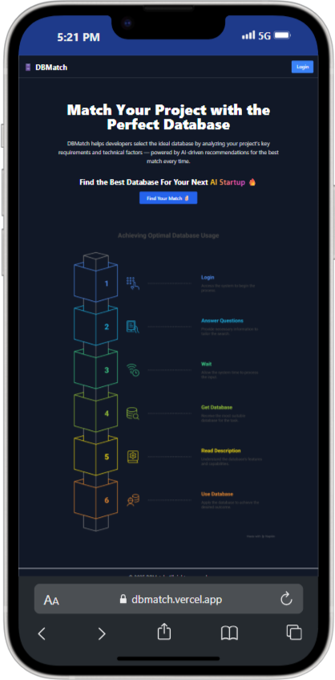

# DBMatch

## Match Your Project with the Perfect Database

DBMatch helps developers select the ideal database by analyzing your project’s key requirements and technical factors — powered by AI-driven recommendations for the best match every time.

## 🌐 Live Demo

👉 [Live Project](https://dbmatch.vercel.app/)


---

## 🖼️ Preview

<table>
  <tr>
    <td></td>
    <td></td>
    <td></td>
  </tr>
  <tr>
    <td></td>
    <td></td>
    <td></td>
  </tr>
   <tr>
    <td></td>
    <td></td>
    <td></td>
  </tr>
    <tr>
    <td></td>
    <td></td>
    <td></td>
  </tr>
</table>

---

### Custome Offline page 


---

## 🛠️ Tech Stack

- **Frontend**: Vite + React
- **Authentication**: Clerk
- **Monitoring & Analytics**:
  - Sentry.io for error tracking
  - PostHog for product analytics

## 🚀 Getting Started

Follow these steps to clone and run the project locally:

```bash
git clone https://github.com/kashyapprajapat/DBMatch_Frontend.git
cd DBMatch_Frontend
npm install
npm run dev
```


#### If You Want to give  a Star 🌟
👉 [GitHub Repository](https://github.com/kashyapprajapat/DBMatch_Frontend)
